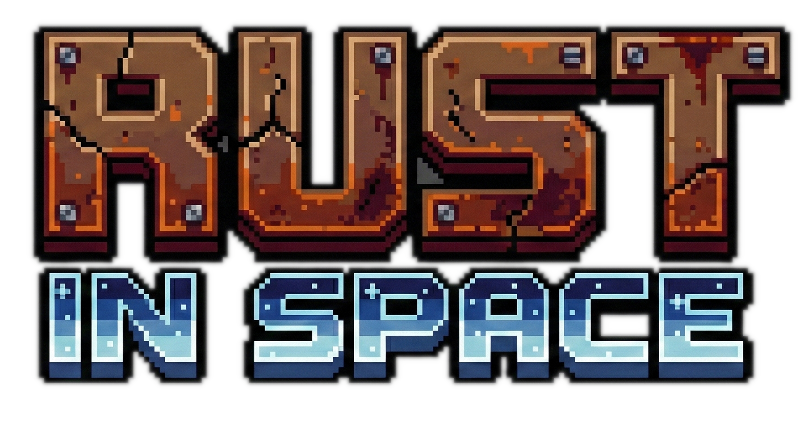

# Rust in Space

<div align="center">
  
  
  
</div>

A classic space shooter game built with Rust and Macroquad. Navigate through space, destroy asteroids and enemy ships, collect powerups, and try to achieve the highest score!

## Features

- **Classic Space Shooter Gameplay**: Rotate and thrust your ship to navigate through space
- **Asteroid Destruction**: Break large asteroids into smaller fragments for bonus points
- **Enemy Ships**: Battle enemy ships that shoot at you
- **Powerups**: Collect health and rapid fire powerups to survive longer
- **High Score System**: Your high score is automatically saved and persists between sessions
- **Lives System**: Start with 3 lives and collect health powerups to extend your survival

## Controls

- **Left Arrow**: Rotate ship counter-clockwise
- **Right Arrow**: Rotate ship clockwise
- **Up Arrow**: Thrust forward
- **Space**: Shoot bullets
- **Enter**: Start game (from menu) or return to menu (from game over screen)

## Installation

### Prerequisites

- [Rust](https://www.rust-lang.org/tools/install) (latest stable version)
- Cargo (comes with Rust)

### Building and Running

1. Clone or download this repository
2. Navigate to the project directory:
   ```bash
   cd space_game
   ```

3. Run the game:
   ```bash
   make run
   ```

   Or for release mode (optimized):
   ```bash
   make run-release
   ```

### Development Commands

This project includes a Makefile with useful commands:

- `make help` - Show all available commands
- `make run` - Run the game in debug mode
- `make run-release` - Run the game in release mode (optimized)
- `make build` - Build the project (debug)
- `make build-release` - Build the project (release)
- `make test` - Run tests
- `make fmt` - Check code formatting
- `make fmt-fix` - Fix code formatting
- `make clippy` - Run clippy linter
- `make check` - Run all checks (fmt, clippy, build, test)
- `make ci` - Run CI checks (same as CI pipeline)
- `make clean` - Clean build artifacts
- `make install-hooks` - Install pre-commit hook

The pre-commit hook automatically runs the same checks as CI before each commit.

## Game Mechanics

### Scoring
- **Asteroids**: 100 points each
- **Enemy Ships**: 500 points each

### Powerups
- **Health Powerup** (Green circle): Adds one extra life
- **Rapid Fire Powerup** (Purple circle): Temporarily increases fire rate (lasts 6 seconds)

### Gameplay

- Start with 3 lives
- Destroy asteroids to break them into smaller pieces
- Enemy ships spawn periodically and shoot at you
- Powerups have a 10% chance to drop when destroying asteroids
- Colliding with asteroids or enemy bullets reduces your lives
- When all lives are lost, your score is saved if it's a new high score

## Project Structure

```
space_game/
├── src/
│   ├── main.rs      # Main game loop and state management
│   ├── components.rs # Game entities and data structures
│   ├── systems.rs   # Game systems (wrapping, save/load)
│   └── draw.rs      # Rendering functions
├── Cargo.toml       # Project dependencies
└── highscore.json   # Saved high score (auto-generated)
```

## Dependencies

- **macroquad** (0.4): Cross-platform game framework for Rust
- **serde** (1.0): Serialization framework
- **serde_json** (1.0): JSON support for serde

## License

MIT