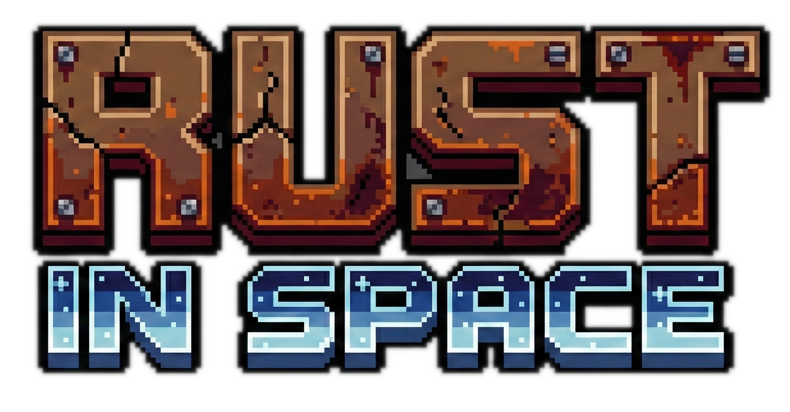

# Rust in Space

<div align="center">
  
  
  
</div>

> *"You're a mercenary pilot, drifting through the outer rim of civilized space. Out here, the only law is what you can enforce with your ship's cannons. The corporations pay well for rust piles and rare metals mined from the asteroid fields, but they don't tell you about the enemy patrols or the void pirates that call these deep space sectors home.*
> 
> *Every mission takes you deeper into the unknown. Every asteroid you crack could be your last. But the credits are good, and in this part of the galaxy, that's all that matters. Strap in, pilot. The void awaits."*

## Features

- **Mission-Based Gameplay**: Complete objectives across multiple levels with increasing difficulty
- **Difficulty System**: Choose from three difficulty levels (Nebula/Easy, Supernova/Normal, BlackHole/Hard)
  - Difficulty affects enemy spawn rates, damage taken, and loot drop chances
- **Upgrade Bay Between Missions**: Spend scrap and gold on permanent ship upgrades before continuing
  - Reinforced Hull, Weapon Tuning, Engine Overdrive, Magnet Array, Shield Capacitor
- **Language Support**: Full UI localization for English, Russian, and German
- **Classic Space Shooter Controls**: Rotate and thrust your ship with smooth engine mechanics
- **Asteroid Destruction**: Break large asteroids into smaller fragments, with rare asteroids dropping valuable loot
- **Enemy Types**: Battle regular shooters and kamikaze ships that rush the player
- **Enemy Health Bars**: Enemy HP is shown with an on-screen health bar
- **Enemy Detector (Nebula)**: On Nebula (easy) level, the game shows where enemies spawn from; enemies do not disappear at the screen border
- **Boss Level**: Special boss level for extra challenge
- **Bullet-to-Bullet Collisions**: Your bullets can intercept and destroy enemy bullets, creating defensive gameplay
- **Pause System**: ESC pauses, ENTER resumes, ESC from pause returns to menu
- **Loot System**: Collect scrap, rare metals, health packs, weapon boosts, and shields
  - **Magnet Effect**: Loot items are automatically attracted to your ship when nearby
  - **Animated Loot**: Items rotate and drift realistically in space
- **Shield System**: Activate shields that absorb damage before it reaches your health
- **Weapon Boosts**: Rapid fire mode and big bullet mode for enhanced firepower
- **Resource Management**: Track rust piles (scrap) and gold (rare metals) separately
- **Health Point System**: Start with 150 HP - bigger asteroids deal more damage!
- **Health Restoration**: Health is fully restored to 150 HP at the start of each mission
- **Variable Damage**: Damage scales with asteroid size and bullet type
- **Enemy Health System**: Enemies have 24 HP and take multiple hits to destroy
- **High Score System**: Your high score is automatically saved and persists between sessions

## Controls

- **Menu**: Up/Down select item, Left/Right change value (difficulty/language), Enter confirm/start
- **Playing**: Left/Right rotate, Up thrust, Space shoot, ESC pause
- **Briefing**: Space launches mission
- **Mission Success**: Enter opens Upgrade Bay
- **Upgrade Bay**: Up/Down select, Enter buy or continue
- **Paused**: Enter resumes, ESC returns to main menu
- **Game Over**: Enter returns to menu

## Installation

### Prerequisites

- [Rust](https://www.rust-lang.org/tools/install) (latest stable version)
- Cargo (comes with Rust)

### Building and Running

1. Clone or download this repository
2. Navigate to the project directory:
   ```bash
   cd rust-in-space
   ```

3. Run the game:
   ```bash
   make run
   ```

   Or for release mode (optimized):
   ```bash
   make run-release
   ```

### Development Commands

This project includes a Makefile with useful commands:

- `make help` - Show all available commands
- `make run` - Run the game in debug mode
- `make run-release` - Run the game in release mode (optimized)
- `make build` - Build the project (debug)
- `make build-release` - Build the project (release)
- `make test` - Run tests
- `make fmt` - Check code formatting
- `make fmt-fix` - Fix code formatting
- `make clippy` - Run clippy linter
- `make check` - Run all checks (fmt, clippy, build, test)
- `make ci` - Run CI checks (same as CI pipeline)
- `make clean` - Clean build artifacts
- `make install-hooks` - Install pre-commit hook

The pre-commit hook automatically runs the same checks as CI before each commit.

## Game Mechanics

### Mission System

The game features a mission-based progression system:
- **Difficulty Selection**: Choose your difficulty level before starting (Nebula/Easy, Supernova/Normal, BlackHole/Hard)
  - **Nebula (Easy)**: 0.8x damage taken, slower enemy spawns, +10% loot luck; enemy detector shows spawn direction and enemies stay on screen (no despawn at border)
  - **Supernova (Normal)**: 1.0x damage taken, normal spawns, standard loot
  - **BlackHole (Hard)**: 1.5x damage taken, faster enemy spawns, -15% loot luck
- **Briefing Screen**: View mission objectives before launching
- **Mission Objectives**: Each mission requires completing specific goals:
  - Destroy a certain number of enemies
  - Collect a certain amount of rust piles (scrap)
  - Collect a certain amount of gold (rare metals)
- **Mission Success**: Complete all objectives to progress to the next level
- **Upgrade Intermission**: After mission success, enter the Upgrade Bay to buy permanent upgrades before the next briefing
- **Boss Level**: A dedicated boss level provides an extra challenge
- **Progressive Difficulty**: Missions become increasingly challenging, then continue with infinitely scaling deep-space sectors
- **Health Restoration**: Your health is fully restored to 150 HP at the start of each new mission
- **State Persistence**: Resources (scrap, gold), active shields, and weapon boosts persist between missions

### Scoring
- **Asteroids**: 100 points each
- **Enemies/Boss**: 10 points per HP
  - Regular enemy (24 HP): 240 points
  - Kamikaze enemy (18 HP): 180 points
  - Boss (300 HP): 3000 points

### Loot System

Loot items drop from destroyed asteroids and enemies:

**From Regular Asteroids:**
- **Rust Piles (Scrap)** (40% chance): 1-3 pieces
- **Gold (Rare Metal)** (5% chance): 1 piece
- **Nothing** (55% chance)

**From Rare Asteroids** (10% chance to spawn, always drop loot):
- **Gold (Rare Metal)** (30% chance): 2-5 pieces
- **Rust Piles (Scrap)** (15% chance): 5-9 pieces
- **Health Pack** (25% chance): Restores 25 HP
- **Rapid Fire Boost** (18% chance): Rapid fire for 10 seconds (3x faster shooting)
- **Big Bullet Boost** (12% chance): Bigger, more powerful bullets for 15 seconds (30 damage vs 15)

**From Enemy Ships:**
- **Rust Piles (Scrap)** (30% chance): 5-9 pieces
- **Health Pack** (25% chance): Restores 25 HP
- **Rapid Fire Boost** (18% chance): Rapid fire for 10 seconds (3x faster shooting)
- **Big Bullet Boost** (12% chance): Bigger, more powerful bullets for 15 seconds (30 damage vs 15)
- **Shield** (8% chance): Activates shield with 30-100 HP that lasts 30 seconds
- **Nothing** (7% chance)

**Note**: Health packs, weapon boosts, and shields do NOT count toward resource collection objectives

**Loot Mechanics:**
- Items drift and rotate in space for visual appeal
- **Magnet Effect**: When within 150 units of your ship, loot is automatically attracted to you
- Items are collected on contact with your ship
- **Resource Tracking**: 
  - Mission objectives track rust piles and gold separately
  - Your inventory shows total resources collected: "Resources: Rust X | Gold Y"
  - Mission progress shows: "Kills: X/Y  Rust: X/Y  Gold: X/Y"

### Gameplay

- **Health System**: Start with 150 HP (displayed as HP: current/max)
- **Health Restoration**: Health is fully restored to 150 HP at the start of each new mission
- **Shield System**: 
  - Shields absorb damage before it reaches your health
  - Shield HP is displayed when active: "SHIELD: current/max"
  - Shields have a duration (30 seconds) and deactivate when HP reaches 0 or timer expires
  - Damage is first applied to shield, then to health if shield is depleted
  - Active shields persist between missions
- **Damage System**:
  - **Asteroid Collisions**: Damage scales with asteroid size (bigger asteroids = more damage)
    - Base damage: 5 HP per 10 units of radius
    - Large asteroids (radius 40): ~20 HP damage
    - Medium fragments (radius 20): ~10 HP damage
    - Small fragments (radius 10): ~5 HP damage
    - Damage is multiplied by difficulty level (Easy: 0.8x, Normal: 1.0x, Hard: 1.5x)
  - **Enemy Bullets**: Deal 15 HP damage (multiplied by difficulty)
  - **Player Bullets**: Deal 15 HP damage to enemies (30 HP with big bullet boost)
  - **Enemy Health**: Enemies have 24 HP and take multiple hits to destroy; each enemy displays a health bar
- **Bullet-to-Bullet Collisions**: Your bullets can intercept and destroy enemy bullets
  - When player and enemy bullets collide, both are destroyed
  - Creates an explosion effect at the collision point
  - Provides defensive gameplay - shoot enemy bullets to protect yourself
- **Pause System**: Press ESC to pause the game at any time
  - Game state is frozen while paused
  - Press ENTER to resume, or ESC to return to main menu
- Complete mission objectives to progress (kills, rust piles, and gold)
- Destroy asteroids to break them into smaller pieces
- Rare asteroids (10% spawn chance) have distinct appearance and always drop loot
- Enemy ships spawn based on mission configuration and difficulty level
- Enemy health bars show remaining HP above each enemy
- On Nebula difficulty, an enemy detector shows where enemies come from; enemies do not despawn at the screen edge
- Regular enemies track your position and shoot; kamikaze enemies rush and explode on contact
- A boss level offers a special high-stakes encounter
- Collect rust piles and gold separately - missions require specific amounts of each
- Health packs restore 25 HP (capped at maximum of 150 HP)
- **Rapid Fire Boost**: Reduces shooting cooldown by 3x for 10 seconds
- **Big Bullet Boost**: Shoots larger, more powerful bullets (30 damage vs 15) for 15 seconds
- **Shield**: Activates a temporary shield that absorbs damage before it reaches your health
- **State Persistence**: Resources (scrap, gold), active shields, and weapon boost timers persist between missions
- When HP reaches 0, your score is saved if it's a new high score

## Project Structure

```
space_game/
├── src/
│   ├── main.rs          # Main loop and game state transitions
│   ├── components.rs    # Game entities and data structures
│   ├── draw.rs          # Rendering and UI functions
│   ├── systems.rs       # Wrapping, save/load, mission/loot generation
│   ├── resources.rs     # Texture/font loading
│   ├── localization.rs  # Language dictionaries and translation lookup
│   └── game/
│       ├── mod.rs       # Game struct, progression, upgrades
│       ├── constants.rs # Gameplay constants
│       ├── player.rs    # Player movement and shooting
│       ├── npc.rs       # Enemy and boss behavior
│       └── physics.rs   # Timers, loot, collisions, physics updates
├── assets/          # Game assets (sprites, textures)
│   ├── loot/        # Loot item textures
│   │   ├── resources/ # Resource textures (scrap, gold)
│   │   └── ...       # Power-up textures (health, boosts, shield)
│   └── ...          # Ship, enemy, asteroid, and bullet textures
├── scripts/         # Development scripts
│   └── pre-commit   # Pre-commit hook
├── Cargo.toml       # Project dependencies
├── Makefile         # Build and development commands
├── rustfmt.toml     # Rust formatting configuration
├── clippy.toml      # Clippy linter configuration
└── highscore.json   # Saved high score (auto-generated)
```

## Dependencies

- **macroquad** (0.4): Cross-platform game framework for Rust
- **serde** (1.0): Serialization framework
- **serde_json** (1.0): JSON support for serde

## Credits & Licenses

### Code
Project is licensed under MIT License.

### Assets
* **Font:** "Press Start 2P" by CodeMan38.
    * License: SIL Open Font License (OFL).
    * [Link to original](https://fonts.google.com/specimen/Press+Start+2P)
* **Graphics:** Created by AI / Self-made.
